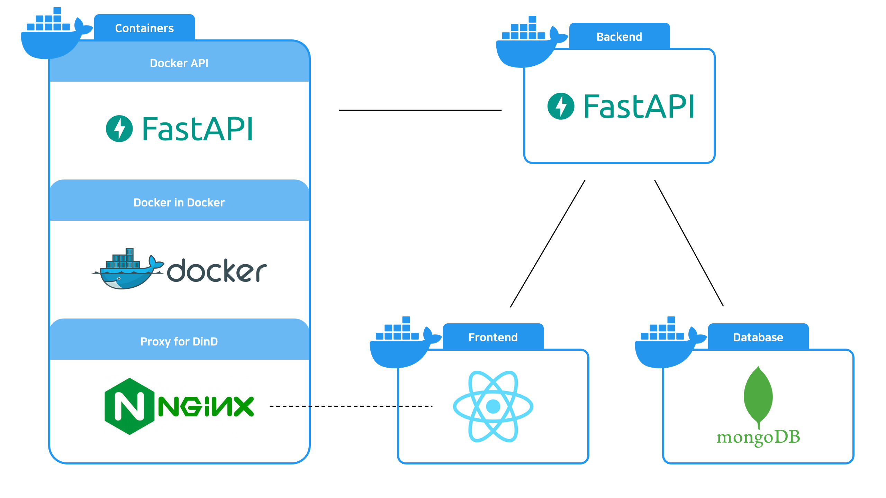

# Cotton Candy
Cloud fits you

Cotton candy is a web-based private cloud service designed for easy and universal deployment.
If host PC running cotton candy exposes only the web port, you can create development environments with its own docker virtual IP and access the IDE through a proxy.  
Cotton candy supports network between containers, so you can develop an app for each service.

The host PC can be run as CSP for you.  
Develop an app(or apps) remotely.

# Architecture



# Requirements [Recommend]
- Docker [23.04]
- kubernetes [1.27]
  - cri-dockerd [0.3.1]

# Built With (Docker compose)
### Backend
- FastAPI

### Frontend
- React

### Container
- Docker

### Database
- MongoDB

# How To Build
```bash
docker compose up
```
